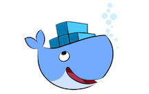

# NCATS Translator

## Data Quality Assessment Implementation  |  Docker + RDFUnit

A Dockerization of the NCATS Translator for Data Quality Analysis.   
The purpose of this project is to provide automation of the [NCATS Translator](https://github.com/pedrohserrano/NCATS-Translator-DQA) stand-alone implementation in order to escalate on more general data quality assessment.

## Prerequisites

- [Docker](https://docs.docker.com/) for [Mac](https://docs.docker.com/docker-for-mac/install/) and [Windows](https://docs.docker.com/docker-for-windows/install/download-docker-for-windows)  

## Usage

##### Clone the repository

        git clone https://github.com/amalic/NCATS-Translator-DQA-Docker.git && \
        cd NCATS-Translator-DQA-Docker

##### Build the Docker image  

        docker build -t translator_dqa .

---
##### Run the Docker container  

- Options  
##### 1. Run translator and show usage text

        docker run -it --rm -p 7200:7200  \
        -v ~/NCATS-Translator-DQA-Docker/data/Input:/root/NCATS-Translator-DQA/Input/ \
        -v ~/NCATS-Translator-DQA-Docker/data/Output:/root/NCATS-Translator-DQA/Output/ \
        translator_dqa -h

##### 2. Run translator with a URL

        docker run -it --rm -p 7200:7200  \
        -v "$PWD"/data/Input:/root/NCATS-Translator-DQA/Input/ \
        -v "$PWD"/data/Output:/root/NCATS-Translator-DQA/Output/ \
        translator_dqa -f https://biosharing.org/biodbcore-000015

On this option you have to make shure that change the url for your dataset url, we expect 2 outputs here `"$PWD"/data/Output`

##### 3. Run translator with a local file

        docker run -it --rm -p 7200:7200 \
        -v "$PWD"/data/Input:/root/NCATS-Translator-DQA/Input/ \
        -v "$PWD"/data/Output:/root/NCATS-Translator-DQA/Output/ \
        translator_dqa -d /root/NCATS-Translator-DQA/Input/kegg-drug.ttl

We provide a dataset for testing, but you can manually put your `.ttl` files on the Input folder `"$PWD"/data/Input`

##### 4. Build the container and keep it running  

        docker run -it -p 7200:7200 \
        -v "$PWD"/data/Input:/root/NCATS-Translator-DQA/Input/ \
        -v "$PWD"/data/Output:/root/NCATS-Translator-DQA/Output/ \
        --name=dqa_box --entrypoint /bin/bash translator_dqa 

We need to start the GraphDB service `service graphdb start`  
In case you want to keep the container running you can make more than one task inside the container, the running command:

        ./translator_dqa.py -d /root/NCATS-Translator-DQA/Input/kegg-drug.ttl

(exit the container `exit`)

In case you want to run again an existing container   

        docker start -ai dqa_box

Notice that we choose `dqa_box` a default name for the container, furthermore, you want to remove it `docker rm dqa_box`

GraphDB is available on  [http://localhost:7200/](http://localhost:7200/)

## Licence

The MIT License (MIT) 2017

## Acknowledgments

* [RDFUnit](http://aksw.org/Projects/RDFUnit.html)
* [FAIRsharing.org](http://FAIRsharing.org)
